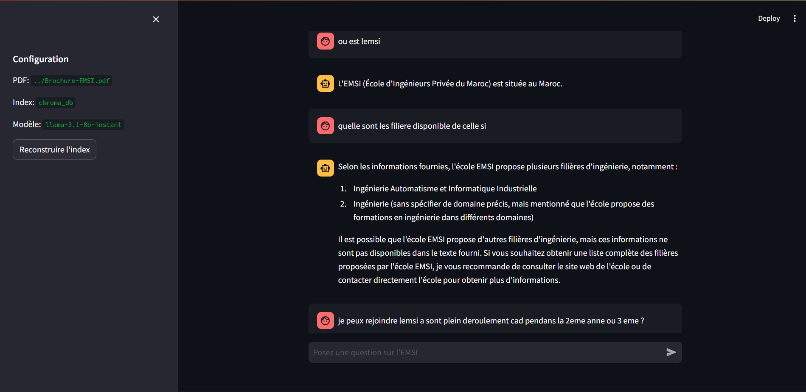

# EMSI Chatbot (RAG)



Ce depot contient:
- Une app Android (dossier `app/`).
- Un chatbot RAG Streamlit base sur LangChain + ChromaDB + Groq (dossier `rag_streamlit/`).

## Objectif
Ce projet met en place un chatbot base sur la technologie RAG (Retrieval-Augmented Generation) qui repond aux questions en s'appuyant sur la brochure EMSI (`Brochure-EMSI.pdf`).

## Apercu technique (RAG)
Flux RAG:
1. Chargement du PDF `Brochure-EMSI.pdf`.
2. Decoupage en chunks.
3. Embeddings (Sentence Transformers).
4. Indexation dans ChromaDB (persistant).
5. Retrieval + generation via Groq (LLM).

Technos principales:
- Streamlit (UI)
- LangChain (RAG)
- ChromaDB (vector store)
- Groq (LLM)
- PyPDF (lecture PDF)
- sentence-transformers (embeddings)

## Ce qui a ete fait
- Creation d'un module Streamlit (`rag_streamlit/`) avec ingestion PDF, index Chroma et UI de chat.
- Configuration centralisee (`rag_streamlit/config.py`) pour les chemins, le modele et les parametres.
- Guide d'installation et d'execution pour un lancement rapide.
- Ajout d'un `.env.example` pour proteger les secrets lors du push.

## Structure
```
EMSI_CHATBOT_LAZIM/
  Brochure-EMSI.pdf
  chat-bot-emsi.png
  .env.example
  rag_streamlit/
    app.py
    ingest.py
    rag.py
    config.py
    requirements.txt
    .env.example
    README.md
```

## Quick start (apres un `git pull`)
1. Copier l'exemple d'environnement.
2. Installer les dependances.
3. Indexer le PDF.
4. Lancer l'UI Streamlit.

## Installation (RAG Streamlit)
Prerequis:
- Python 3.10+
- Cle API Groq
- PDF `Brochure-EMSI.pdf` a la racine du depot

Depuis `rag_streamlit/`:
```powershell
python -m venv .venv
.\.venv\Scripts\Activate.ps1
pip install -r requirements.txt
```

## Configuration
Le fichier d'exemple est ici:
- `rag_streamlit/.env.example` (ou le `.env.example` a la racine)

Copie-le en `.env` dans `rag_streamlit/` et ajoute ta cle:
```ini
GROQ_API_KEY=VOTRE_CLE_ICI
```

Le chemin PDF par defaut est `../Brochure-EMSI.pdf` (depuis `rag_streamlit/`).

## Lancer apres un pull (resume)
Depuis `rag_streamlit/`:
```powershell
.\.venv\Scripts\Activate.ps1
python ingest.py
streamlit run app.py
```

## Lancer l'indexation
Depuis `rag_streamlit/`:
```powershell
python ingest.py
```

## Lancer l'application
Depuis `rag_streamlit/`:
```powershell
streamlit run app.py
```

## Test rapide
Depuis `rag_streamlit/`:
```powershell
python run_local.py
```
